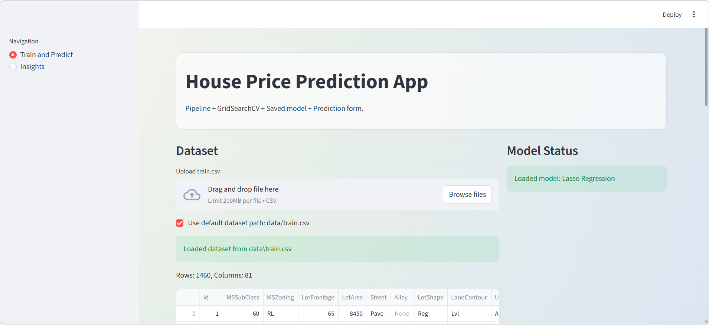
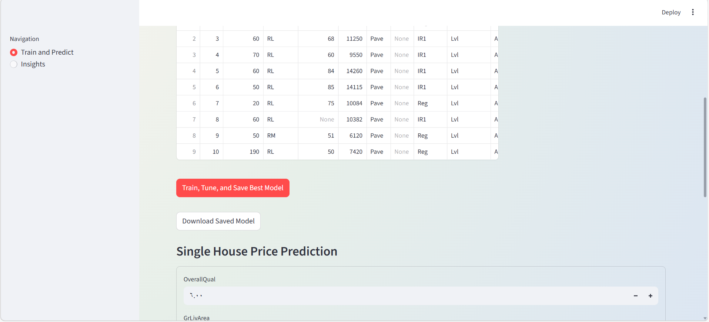
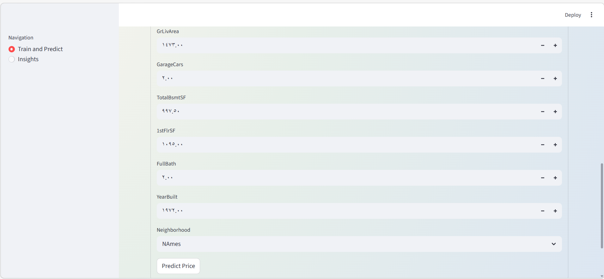
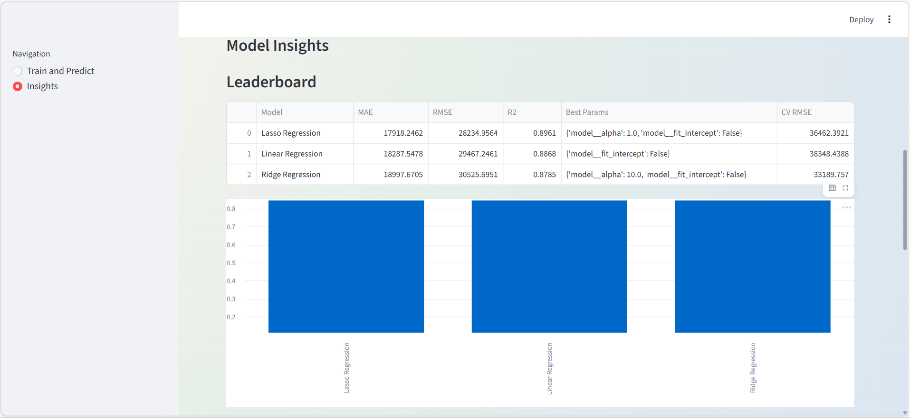
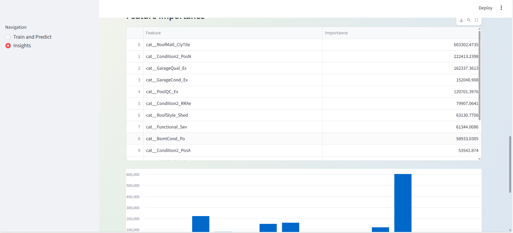

# 🏠 House Price Prediction – Advanced Regression Models ( version(2) )

This project predicts house prices using multiple regression models and compares their performance using standard evaluation metrics.  
It is based on the **Ames Housing Dataset** and follows a clean, modular Machine Learning workflow.

---

## 📌 Project Features
- Data loading and inspection
- Data preprocessing:
  - Handling missing values
  - One-hot encoding for categorical features
  - Train/Test split
- Multiple regression models:
  - Linear Regression
  - Polynomial Regression
  - Ridge Regression
  - Lasso Regression
- Model evaluation using:
  - MAE (Mean Absolute Error)
  - RMSE (Root Mean Squared Error)
  - R² Score
- Clear comparison of model performance

---

## 🗂 Project Structure
```
/house_price_prediction/
│
├── src/
│ ├── main.py # Entry point of the project
│ ├── data_loader.py # Load dataset
│ ├── preprocessing.py # Data cleaning & feature engineering
│ └── model.py # Training & evaluation of models
│
├── data/
│ └── train.csv # Dataset (not included in repo)
│
├── README.md
└── requirements.txt
```

## ⚙️ How to Run the Project
```
pip install -r requirements.txt
```
## Dont forget to download the dataset from Kaggle 
- https://www.kaggle.com/code/ryanholbrook/feature-engineering-for-house-prices?select=train.csv
### run the main 
```
python src/main.py
```

### run the Streamlit UI
```
python -m streamlit run app.py
```

### run tests
```
pytest -q
```

## Demo Video
Watch the full demo here:
- https://drive.google.com/file/d/1qWHrBKAfkwG3hAOaYvQMkgbn6k5UtX_g/view?usp=sharing

## App Screenshots
### 1) Main Dashboard


### 2) Training and Model Comparison


### 3) Prediction Form


### 4) Insights Page


### 5) Additional View


## Updated Project Structure
```
house_price_prediction_advanced/
|
|-- app.py
|-- data/
|-- models/
|   |-- .gitkeep
|-- src/
|   |-- main.py
|   |-- data_loader.py
|   |-- pipeline_training.py
|   |-- streamlit_app.py
|-- requirements.txt
|-- README.md
```

## UI Capabilities
- Upload a housing CSV file or use `data/train.csv`
- Train multiple models with GridSearchCV tuning
- Save and load best model artifact using joblib (`models/best_model.joblib`)
- Download saved model from the UI
- Predict single-house price using a manual input form
- Reuse the exact same preprocessing via scikit-learn Pipeline
- View model comparison bar chart
- View actual vs predicted scatter plot
- View top feature importance table/chart
- Navigate to a dedicated Insights page for leaderboard and feature analysis

## Progress Status
### Completed
- Model persistence (`joblib`) after training
- Prediction form in Streamlit
- Consistent preprocessing through Pipeline (imputation + scaling + one-hot)
- Model tuning with GridSearchCV
- Visualizations: model comparison and actual vs predicted
- Feature importance from linear model coefficients
- Pytest test suite for training, save/load, and prediction frame

### Still Not Completed
- Advanced explainability (e.g., SHAP)
- CI workflow for training/evaluation checks

## key Lernings 
- Importance of handling missing data before training
- Effect of regularization (Ridge & Lasso) on model performance
- Polynomial regression can easily overfit without proper scaling
- Clean code structure improves readability and maintainability

## 🚀 Future Improvements
- Add feature scaling using Pipeline
- Hyperparameter tuning with GridSearchCV
- Feature importance visualization
- Model persistence using joblib

---
## Authors 
### Alaa Madi


